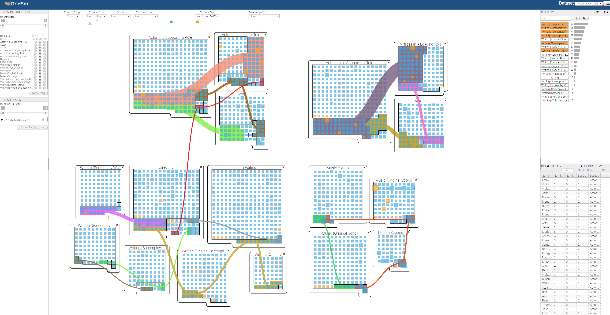

# GridSet

## About

GridSet is a set visualization for exploring elements, their attributes, intersections, as well as entire sets. In this set visualization, each set representation is composed of glyphs, which represent individual elements and their attributes utilizing different visual encodings. In each set, elements are organized within a grid treemap layout that can provide space-efficient overviews of the elements structured by set intersections across multiple sets. These intersecting elements can be connected among sets through visual links. These visual representations for the individual set, elements, and intersection in GridSet facilitate novel interaction approaches for undertaking analysis tasks by utilizing both macroscopic views of sets, as well as microscopic views of elements and attribute details. In order to perform multiple set operations, GridSet supports a simple and straightforward process for set operations through dragging and dropping set objects. 

## Demo Video
[](https://youtu.be/f_4uCdpD_ME)

## View in GitHub

You can view the GitHub project at [https://github.com/SanthoshNandha/GridSet](https://github.com/SanthoshNandha/GridSet)


## Demo

A demo of GridSet for different datasets is available at:  
* Acardemy Award: https://santhoshnandha.github.io/GridSet/web/
* Global Disputes: https://santhoshnandha.github.io/GridSet/web/?dataset=globalDisputes
* Toy Example: https://santhoshnandha.github.io/GridSet/web/?dataset=toyExample
* Countries-Export: https://santhoshnandha.github.io/GridSet/web/?dataset=contriesExport
* Fruits: https://santhoshnandha.github.io/GridSet/web/?dataset=fruits
* Simpsons: https://santhoshnandha.github.io/GridSet/web/?dataset=simpsons
* Social Network: https://santhoshnandha.github.io/GridSet/web/?dataset=socialgraph


## Local Deployment

1. Clone the repository using ```git clone``` or download and extract the [ZIP file](https://github.com/SanthoshNandha/GridSet/archive/master.zip).
1. Launch the [Python SimpleHTTPServer](https://docs.python.org/2/library/simplehttpserver.html) in the project directory.
	
	* Python 2
   ```
   $ python -m SimpleHTTPServer 8000
   ```
   * Python 3
   ```
   $ python -m http.server 8000 &
   ```


1. View GridSet in your browser at [localhost:8000/web](http://localhost:8000/web).

## To Add a New Dataset

1. Create a new folder within the \data folder.
1. Add the dataset in the CSV format to the created folder
	* Each row is a Set Element
	* Each column is an Element Attribute or a Set
	
1. Create the metadata file (JSON file) for the CSV within the same folder
	#### Example JSON format
	```
	{	
		// Location of the CSV file
		"file": "../data/datasetName/datasetname.csv",
	
		// Name of the dataset	
		"name": "Acadamey Awards", 
	
		// Row number which contains the column headers
		"header": 0, 
	
		// Type of Sperator. only "," supportted currently	
		"separator": ",", 
	
		// The row numbers that needs to be skiped
		"skip": 0, 
	
		//Metadata of the element attributes
		"type" -- type of attribute	
		"Index" -- column number of attribute
		"name" -- Name of the attribute
		"tableDisplay" -- Decides if the attribute needs to be shown in  the detailed view or not
		"meta": [ 
				{ "type": "id", "index": 0, "name": "Name","tableDisplay":"true" },
				{ "type": "integer", "index": 1, "name": "Nominations","tableDisplay":"true"},	
				{ "type": "text", "index": 2, "name": "Nominated 2017","tableDisplay":"true"}
		], 
	
		// column range that repersent the sets\ 
		"sets": [
			{ "format": "binary", "start": 3, "end": 116 }
		],
	
    	"author": "",
    	"description": "",
    	"source": ""
	}

1. Add the link of the JSON file as Json object to the array in the data/datsets.json file
	### Example
	```
	{
        	"name" : "AcadameyAwards2017",
        	"link":"../data/AcadameyAwards2017/awards2017.json",
			"dataname": "academyAwards"
    	}
	```
1. Restart the python server and go to [localhost:8000/web/?dataset=academyAwards](http://localhost:8000/web/?dataset=academyAwards). The new dataset will be visible in the dropdown box.
1. Note: The value of the "dataname" property in the datsets.json is used as the url parameter value.
